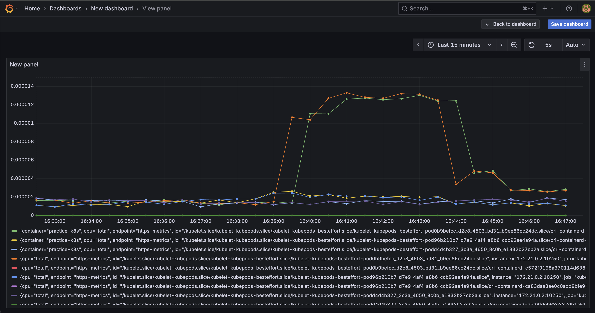

# Practicing with Kubernetes and Observability

Spins up a local Kubernetes cluster with Prometheus + Grafana and visualize CPU for a 3-replica app

---


## Pre-reqs
- [Docker desktop](https://www.docker.com/products/docker-desktop) (running)
- [kind](https://kind.sigs.k8s.io/)
- [helm](https://helm.sh/)
- Go 

---
## To run locally run these commands

```bash
  $ chmod +x launch.sh
  $ ./launch.sh
```
---
## Visualize CPU usage
Once you've got it launched go to http://localhost:3000/ and then
create a new dashboard and use the following PromQL query:
`rate(container_cpu_usage_seconds_total{pod=~"practice-k8s.*"}[5m])`
You should then see a graph similar to:

---
## TODO:
Probably just gonna use this repo for more kubernetes and observability stuff so I'll add:
- a caching layer and then setup metrics for cache hits/misses.
- Loki or ELK for centralized logging
- Distributed tracing and make downstream calls
- ConfigMaps and secrets
- Horizontal autoscaling based on metrics
